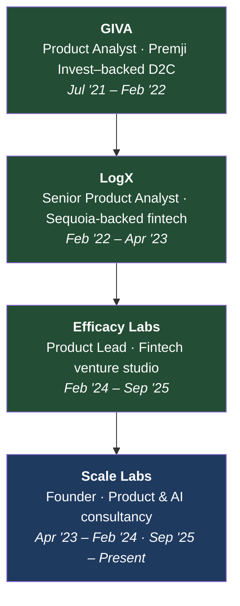

# Hi, I'm Mohit 👋

**AI Product Manager · Founder-Operator · 0→1 Builder**

Engineer-turned-product-builder with 5 years shipping AI and data products 0→1 across fintech and consumer. I came into product through data, and I live in the product–engineering loop — writing research docs, wireframing flows, prototyping in Python, shipping FastAPI backends, and running model evals. I scaled a trading & automated-investing platform (Efficacy Labs' Kriya) from $30M to $117M in managed assets, and I run my own product & AI practice — most recently building AI-native education products at Quad AI.

📫 [work.mohitj@gmail.com](mailto:work.mohitj@gmail.com) · [X @jainXBT](https://x.com/jainXBT) · [LinkedIn](https://www.linkedin.com/in/mohit-jain-19b255129/)

---

### Impact

| Metric | Achievement | Context |
| :--- | :--- | :--- |
| **$117M+** | Peak AUM | Scaled Efficacy Labs' Kriya from $30M → $117M (5× volume) via incentive design & UX. |
| **20×** | User scale | Grew GIVA app DAUs from 2K → 40K via behavioral data loops. |
| **500K** | Users served | Architected a ClickHouse + 5-model SQL analytics stack for a 500K-user client. |
| **$100K+** | Consulting revenue | 20+ clients · 40+ engagements across data, growth & incentive design. |
| **~90%** | Research time cut | Built a multi-agent research system (~3–4 hrs → <30 min per report). |

---

### 🤖 AI Builds

Hands-on AI product work — I prototype and ship these myself.

- **[Prompt Arena](https://prompt.quadcse.com/)** — a two-model AI pipeline: a generation model scored by a separate rubric-based evaluator, with scheduled daily challenges and on-demand batch regeneration to avoid redundant generation cost at scale.
- **[Venture Researcher / PersonalOS](https://github.com/mohitjain121/PersonalOS)** — a multi-agent, persistent research system on the Hermes (Nous Research) framework with evidence-grounding gates, deterministic rules, and a red-team layer that catches model-generated inaccuracies. ~90% research-time cut.
- **[research-agent](https://github.com/mohitjain121/research-agent)** — an autonomous LangGraph agent that discovers, evaluates, and curates technical articles with human-in-the-loop review over Telegram. Python · Supabase · LangGraph.
- **Quad AI ([quadcse.com](https://www.quadcse.com/))** — sole product operator for an AI-first education venture: Next.js rebuild, admissions, payments, LMS, and a data-driven [College Predictor](https://jeepredictor.quadcse.com/). 500+ monthly inbound leads.

---

### 📚 Case Studies

The reasoning behind the numbers, not just the results.

| Case Study | Summary | Key Results |
| :--- | :--- | :--- |
| **[Chakra Season 3 — Revenue-Weighted Incentive Design](https://github.com/mohitjain121/case-studies/tree/master/chakra)** | Reward-rate model and campaign mechanics for Kriya's final points season ahead of the $KDX token launch. | 70,000+ accounts · $30M → $117M AUM · 5× volume · ~$700K revenue |
| **[Council of LLMs — Multi-Agent Idea Validation with Anti-Hallucination Rails](https://github.com/mohitjain121/case-studies/tree/master/council-of-llms)** | An 8-stage pipeline that stress-tests "should I build this?" — six MECE specialist models, an adversarial red team on a stronger model, and mechanical code gates that constrain the verdict to what the evidence supports. Plus the failure that taught me why AI systems must fail loudly. | 6-role MECE council · 3 stacked anti-hallucination layers · adversarial red team · mechanical verdict gates |
| **[Consolidating a Fragmented Data Stack — ClickHouse Migration for a 500K-User ISP](https://github.com/mohitjain121/case-studies/tree/master/isp-data-infra)** | Migrated a multi-database (MySQL, Postgres, MongoDB), 40+ table, 50M+ row reporting process into a columnar store with five single-source-of-truth SQL models — replacing hours of manual, crash-prone Excel merging with near-instant queries. | 500K users · 3 stores → 1 columnar store · 5 SQL models · hours → instant · 12+ analyst hrs/day saved |
| **[Habuild — Building Funnel Visibility and Fixing the Leak](https://github.com/mohitjain121/case-studies/tree/master/habuild)** | Instrumented a virtual health platform's acquisition funnel from paid-ad attribution through to first live class, fixed the event tracking, and closed the biggest drop-off (register-click → form-fill) with an inline home-page form and on-open push nudge. | Ad → first-class funnel built · attribution + dashboard · register-step leak fixed · +20% WoW first-class joins |
| **[Persistence (pStake) — On-Chain Analytics & Competitive Benchmarking for a Liquid Staking Protocol](https://github.com/mohitjain121/case-studies/tree/master/persistence-pstake)** | A ~1-year, 6–8 project analytics partnership: protocol deep-dives, vault/yield-integration breakdowns, a standardized pStake-vs-Stader-vs-ANKR benchmarking framework, and tri-asset pool risk monitoring — backed by real published SQL. | ~1 yr · 6–8 projects · 3-protocol benchmarking framework · tri-asset risk monitor · vault-level yield analytics |

👉 **[Browse all case studies](https://github.com/mohitjain121/case-studies)**

---

### 🧠 How I Think

Product teardowns, opinions, and narratives on fintech, AI, and building.

- **[What I Think of INDmoney](https://github.com/mohitjain121/case-studies/tree/master/teardowns/indmoney)** — a teardown on why "access" isn't the moat, and how I'd rebuild it into the default platform for cross-border investing from India, instead of another superapp.
- **[How I Advised Big Brain VC to Pass on Satis](https://github.com/mohitjain121/case-studies/tree/master/teardowns/big-brain-satis)** — a 2022 investment due-diligence on a derivatives trading platform: why a real market still wasn't a reason to back this team. Product teardown, competitor scorecard, and a falsifiable "pass."

---

### Career Trajectory

*Data analyst → product owner → 0→1 operator → founder. The through-line: I came into product through data, and I take ambiguous problems 0→1.*

**Scale Labs — Founder, Product & AI Consultancy** · *Apr '23 – Feb '24 · Sep '25 – Present*
Independent product & data practice — 20+ clients, 40+ engagements, $100K+ revenue. Current focus is AI-native product builds. Flagship work:

- **[Quad AI](https://www.quadcse.com/)** — sole product operator for an AI-first education venture ([Prompt Arena](https://prompt.quadcse.com/), [College Predictor](https://jeepredictor.quadcse.com/), LMS / admissions / payments; 500+ monthly leads).
- **[500K-user data infrastructure](https://github.com/mohitjain121/case-studies/tree/master/isp-data-infra)** — ClickHouse migration + 5 SQL models consolidating revenue, tickets, churn, inventory & onboarding (12+ analyst hrs/day saved).
- **[Habuild](https://github.com/mohitjain121/case-studies/tree/master/habuild)** — rebuilt a paid-ad → first-class acquisition funnel (+20% WoW signups).
- **Analytics & growth** — delivered data, growth, and competitive-benchmarking solutions to 20+ startups and funds.

**Efficacy Labs — Product Lead, Fintech Venture Studio** · *Feb '24 – Sep '25*
Kriya, our core product, is analogous to a broker combined with automated investment strategies. As one of three people, I led its launch across five parallel workstreams. Designed the gamified rewards economics that drove **70,000+** users and scaled the platform **$30M → $117M** in managed assets (**5× volume**, **$1.5M+** revenue) ([full case study](https://github.com/mohitjain121/case-studies/tree/master/chakra)), and built an LLM research agent that cut team research **8 hrs → 15 min**. Ran BD and integrations with **30+** institutional partners across APAC / EU / US.

**[LogX](https://logx.network/) — Senior Product Analyst, Sequoia-backed Fintech** · *Feb '22 – Apr '23*
Built the analytics function from zero — schema, **30+** dashboards, **500+** SQL queries. Authored **8+** research reports that drove two critical product pivots.

**[GIVA](https://www.giva.co/) — Product Analyst, Premji Invest-backed D2C** · *Jul '21 – Feb '22*
First product hire. Scaled the app **20×** (2K → 40K DAUs) and paying customers **8×** (₹1Cr+ / $120K+ monthly), cutting homepage-to-product drop-off **80%** through systematic A/B testing.

---

### 💼 Data & Analytics Consulting

*Startups fail because they don't know who their users are. I fix that.*

Alongside product work, I've delivered data, growth, and analytics solutions to **20+** startups and funds — **$100K+** revenue across **40+** engagements. The work spans user & retention analytics, growth instrumentation, competitive benchmarking, and quality/fraud analytics over large datasets.

Much of the underlying SQL is public 📂 **[data-engineering portfolio →](https://github.com/mohitjain121/web3-data-engineering-portfolio)** — dashboards, models, and queries across 25+ projects.

- 📊 **Growth & retention analytics** — funnels, cohorts, liquidity/LP efficiency, competitive benchmarking.
- 🕵️ **User quality & fraud** — clustering users to separate real demand from bots and optimize spend.
- 🏦 **Treasury & governance dashboards** — holdings, proposal outcomes, and portfolio ROI for funds.
- 🔎 **Investment due diligence** — market, product, and KPI analysis (see the [Satis teardown](https://github.com/mohitjain121/case-studies/tree/master/teardowns/big-brain-satis)).

Open to fractional data & growth work → [email me](mailto:work.mohitj@gmail.com).

---

### 🔭 Now

- Building AI-native products through **Scale Labs / Quad AI**, and exploring full-time **AI PM** roles.
- Deep in the AI tooling loop — Claude Code, Cursor, LangGraph, evals — shipping autonomous agents.
- ⚡ **Fun fact:** FIDE chess rating **1658**, 6+ tournament accolades. Up for a match if you're around Bangalore.

---

### Stack

  

Python · FastAPI · SQL · LangChain/LangGraph · MCP · RAG · Evals · Supabase · Vercel · GA4 · Mixpanel · Claude Code
Plus: incentive & economic modeling, schema design, A/B testing, growth & product analytics.

---

### ✍️ Writing

Breakdowns on fintech, markets, and data strategy.
👉 **[Research Archive on Notion](https://www.notion.so/mohit-jain/Crypto-Research-229a4965f1d880b1a96bf35d25b2e096)**

📫 Reach me: [work.mohitj@gmail.com](mailto:work.mohitj@gmail.com) · [X @jainXBT](https://x.com/jainXBT) · [LinkedIn](https://www.linkedin.com/in/mohit-jain-19b255129/)
